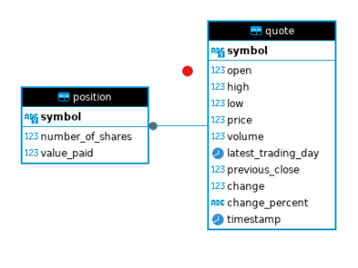

# Introduction
The Stock Quote App is a simple stock wallet simulator that utilizes the Alpha Vantage API to retrieve stock data and a PostgreSQL database to persist user transactions. The application allows users to view stock quotes, buy stocks, and manage their portfolio with an infinite amount of virtual cash. Technologies used in this project include `JDBC` for database connectivity, `PostgreSQL` for data storage, `Maven` for project management and build automation, and `Docker` for containerization.

# Implementaiton
## ER Diagram

## Design Patterns
The application employs the Data Access Object (DAO) and Repository design patterns to separate the persistence logic from the business logic. The DAO pattern is used to abstract and encapsulate all access to the data source. The QuoteDao and PositionDao classes implement this pattern by providing CRUD operations for Quote and Position entities, respectively. This separation allows for more modular, testable, and maintainable code by isolating the database access layer from the rest of the application.

The Repository pattern, a specialized version of the DAO pattern, is also used to manage collections of objects. It acts as a middle layer between the DAO and the service layer, offering a collection-like interface for accessing domain objects. The QuoteService and PositionService classes use these repositories to perform business operations, such as fetching stock quotes from the API and managing user positions. This pattern enhances testability by allowing mock implementations of DAOs and repositories during unit testing, ensuring that business logic can be tested independently of the data source.

# Test
To test the Stock Quote App against the database, follow these steps:

* **Database Setup:** Ensure PostgreSQL is running and create a database named stock_quote. Configure the connection properties in src/main/resources/properties.txt.

* **Test Data Setup:** Populate the database with initial test data using SQL scripts or manually through a database client. Ensure that tables for Quote and Position are created and appropriately structured.

* **Running Tests:** Use Maven to run tests by executing mvn test. The tests will use JDBC to connect to the database and verify CRUD operations on the Quote and Position tables. Ensure that the test methods clean up any test data to maintain a consistent test environment.

* **Query Results:** Verify query results by comparing the expected outcomes with actual data retrieved from the database. Use assertions in test methods to automate this verification process.

By following these steps, you can ensure that your application interacts correctly with the PostgreSQL database, providing reliable and accurate functionality for managing stock quotes and user portfolios.