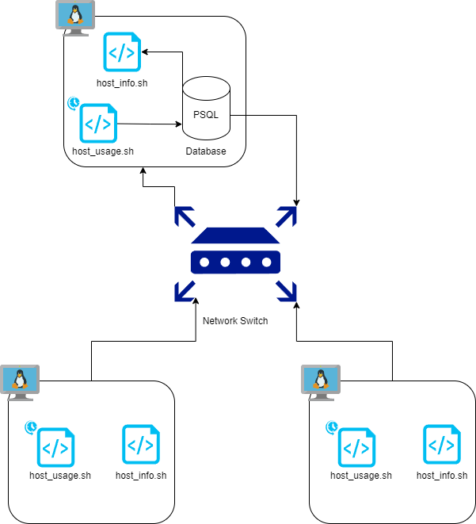

# Linux Cluster Monitoring Agent

This project develops an MVP to monitor and analyze hardware specs and resource use across Linux clusters in real-time. It offers essential insights for system admins and development teams to enhance performance using **Bash**, **PostgreSQL**, **Docker**, and **Git**. The automation of data collection and storage by the Linux Cluster Monitoring Agent allows seamless system health and performance monitoring, proving vital for IT infrastructure management.

## Quick Start
```bash
# Start a psql instance using psql_docker.sh
./psql_docker.sh create db_username db_password

# Create tables using ddl.sql
psql -h localhost -U postgres -d host_agent -f sql/ddl.sql

# Insert hardware specs data into the DB using host_info.sh
./host_info.sh localhost 5432 host_agent postgres password

# Insert hardware usage data into the DB using host_usage.sh
./host_usage.sh localhost 5432 host_agent postgres password

# Crontab setup
crontab -e
# Add the following line to the crontab
* * * * * bash /path/to/host_usage.sh localhost 5432 host_agent postgres password > /tmp/host_usage.log
```

## Implementation

### Architecture

### Scripts

* #### psql_docker.sh
Manages Docker PostgreSQL container (start/stop/create).
```bash
./psql_docker.sh start|stop|create db_username db_password
```

* #### host_info.sh
Collects hardware specifications and inserts them into the database.
```bash
./host_info.sh psql_host psql_port db_name psql_user psql_password
```

* #### host_usage.sh
Collects current machine usage and inserts into the database.
```bash
./host_usage.sh psql_host psql_port db_name psql_user psql_password
```
* #### Crontab
Schedules the host_usage.sh script to run every minute.

* #### queries.sql
Contains SQL queries to answer specific business questions, such as average memory usage over time.

### Database Modeling

**host_info**

| Column            | Type      | Description                   |
|:------------------|:----------|:------------------------------|
| id                | SERIAL    | Primary key                   |
| hostname          | VARCHAR   | Unique hostname               |
| cpu_number        | INT2      | Number of CPUs                |
| cpu_architecture  | VARCHAR   | CPU architecture              |
| cpu_model         | VARCHAR   | CPU model name                |
| cpu_mhz           | FLOAT8    | CPU clock speed in MHz        |
| l2_cache          | INT4      | L2 cache size in KB           |
| total_mem         | INT4      | Total memory in KB            |
| timestamp         | TIMESTAMP | Time of data collection       |

**host_usage**

| Column         | Type      | Description                        |
|:---------------|:----------|:-----------------------------------|
| timestamp      | TIMESTAMP | Time of data collection            |
| host_id        | INT       | Foreign Key to `host_info` table   |
| memory_free    | INT4      | Free memory in MB                  |
| cpu_idle       | INT2      | CPU idle percentage                |
| cpu_kernel     | INT2      | CPU kernel mode percentage         |
| disk_io        | INT4      | Number of disk I/O                 |
| disk_available | INT4      | Available disk space in MB         |

## Test
Testing was conducted manually for both Bash scripts and DDL. The correctness of the scripts and the accuracy of the SQL queries were verified on a single machine setup.


## Deployment
Deployment uses **crontab** for scheduling script executions, Docker for database provisioning, and Git for source code management, leveraging GitHub for remote version control.


## Improvements
* **Handle Hardware Updates:** Develop functionality to detect and update changes in hardware specifications.
* **Enhanced Data Visualization:** Integrate with tools like Kibana for real-time data visualization and monitoring.