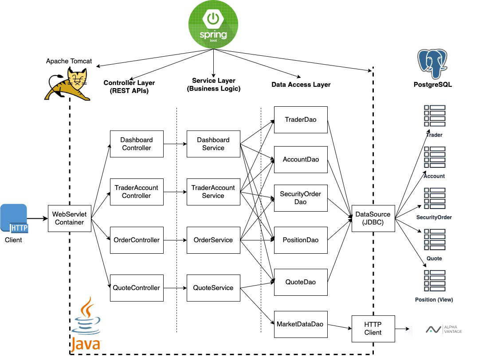

# **Table of Contents**

* [Introduction](#Introduction)
* [Quick Start](#Quick Start)
* [Implementation](#Implementation)
* [Architecture](#Architecture)
* [REST API Usage](#REST API Usage)
* [Swagger](#Swagger)
* [Quote Controller](#Quote Controller)
* [Trader Controller](#Trader Controller)
* [Order Controller](#Order Controller)
* [Trader Account Controller](#Trader Account Controller)
* [Dashboard Controller](#Dashboard Controller)
* [Test](#Test)
* [Deployment](#Deployment)
* [Improvements](#Improvements)

## Introduction

This project is designed to manage client accounts and execute security orders within a trading system. The application facilitates the management of clients and their accounts, executes buy and sell orders for securities, and provides real-time market data. The project uses Java, Spring Boot, Docker, PostgreSQL, and integrates with the Alpha Vantage API for market data.

## Quick Start

* **Prerequisites:** Ensure you have Docker installed on your system.
* **Docker Scripts and Descriptions:**
  * Build Images:
  ```
  cd ./springboot/psql 
  docker build -t trading-psql .
  cd ../
  docker build -t trading-app .
  ```
  * Create a Docker Network:
  ```
  docker network create trading-net
  ```
  * Start Containers:
  ```  
  docker run --name trading-psql-dev -e POSTGRES_PASSWORD=password -e POSTGRES_DB=jrvstrading -e POSTGRES_USER=postgres --network trading-net -d -p 5432:5432 trading-psql
  docker run --name trading-app-dev -e "PSQL_URL=jdbc:postgresql://trading-psql-dev:5432/jrvstrading" -e "PSQL_USER=postgres" -e "PSQL_PASSWORD=password" -e "ALPHA_VANTAGE_API_KEY=your_alpha_vantage_api_key" --network trading-net -p 8080:8080 trading-app
  ```
* **Try Trading-App with SwaggerUI:**
  Open a web browser and navigate to http://localhost:8080/swagger-ui.html. You should see a Swagger UI interface to interact with the trading app's REST API.
  

## Implementation

### Architecture

#### Component Diagram:


#### Component Descriptions:

* **Controller Layer:** Handles user requests, maps them to appropriate services, and returns the response.
* **Service Layer:** Contains business logic and interacts with DAOs to retrieve and process data.
* **DAO Layer:** Manages database interactions and CRUD operations.
* **Spring Boot:** Provides the web servlet/Tomcat server and manages Inversion of Control (IoC) for dependency injection.
* **PSQL and Alpha Vantage:** PostgreSQL is used for persistent data storage. Alpha Vantage is used to fetch real-time market data.

## REST API Usage

### Swagger

Swagger is an open-source software framework that helps developers design, build, document, and consume RESTful web services. It provides a user-friendly interface to interact with the API endpoints and view the API documentation.

### Quote Controller

* **Description:** Manages market data retrieved from Alpha Vantage and caches it in PostgreSQL.
* **Endpoints:**
  * **GET /quote/dailyList:** Lists all available securities for trading.
  * **GET /quote/iex/ticker/{ticker}:** Fetches the latest quote for a specific ticker.
  * **PUT /quote/:** Updates or adds a new quote.
  * **PUT /quote/avMarketData:** Updates all the quotes with the current prices

### Trader Controller

* **Description:** Manages trader and account information, handles fund deposits and withdrawals.
* **Endpoints:**
  * **POST /trader:** Creates a new trader and account.
  * **DELETE /trader/{id}:** Deletes a trader and associated account.
  * **POST /trader/deposit:** Deposits funds into an account.
  *POST /trader/withdraw:** Withdraws funds from an account.

### Order Controller

* **Description:** Executes buy and sell orders for securities.
* **Endpoints:**
  * **POST /order/marketOrder:** Submits a market order.

### Trader Account Controller
* **Description:** Manages trader and account creation, deletion, and fund operations.
* **Endpoints:**
  * **DELETE /trader/traderId/{traderId}:** Deletes a trader.
  * **POST /trader/:** Creates a new trader.
  * **POST /trader/firstname/{firstname}/lastname/{lastname}/dob/{dob}/country/{country}/email/{email}:** Creates a new trader with specified details.
  * **PUT /trader/deposit/traderId/{traderId}/amount/{amount}:** Deposits funds into a trader's account.
  * **PUT /trader/withdraw/traderId/{traderId}/amount/{amount}:** Withdraws funds from a trader's account. 

### Dashboard Controller
* **Description:** Provides a dashboard view of trader accounts and portfolio.
* **Endpoints:**
  * **GET /dashboard/trader/{traderId}:** Retrieves the trader account view.
  * **GET /dashboard/portfolio/{traderId}:** Retrieves the portfolio view.

## Test

The application is tested using JUnit and Mockito for unit testing, and the integration tests are conducted using Spring Boot's test support. Code coverage is ensured to be comprehensive by covering all layers of the application.

## Deployment

### Docker Diagram:


### Image Descriptions:

* **trading-psql:** Initializes the PostgreSQL database with necessary tables and views.
* **trading-app:** Compiles and packages the trading application using Maven, then runs the application using an OpenJDK image.

## Improvements

If given more time, the following improvements could be made:

* Implement a more sophisticated error handling mechanism across the application.
* Enhance the caching strategy for market data to improve performance.
* Add more comprehensive integration tests to cover edge cases and ensure robustness.